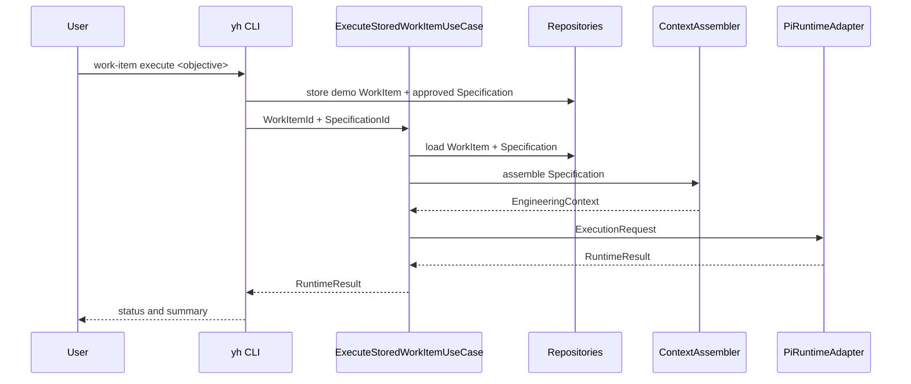

# Execution Flow

## Implemented flow

`ContextAssembler` only projects approved domain Specifications into execution-safe data. `ExecuteStoredWorkItemUseCase` loads the aggregates through repository ports and delegates to `ExecuteWorkItemUseCase`. Neither use case changes WorkItem state after a runtime result; completion remains an explicit engineering decision.

## Current limitation

Repository-backed loading is implemented in Application and verified with an in-memory repository plus `FakeRuntimePort`. The CLI still creates demonstration aggregates and stores them in memory; persistent repositories, user-facing identifiers and contextual requirement selection are not implemented yet. The CLI also composes Pi directly until runtime selection is available.
