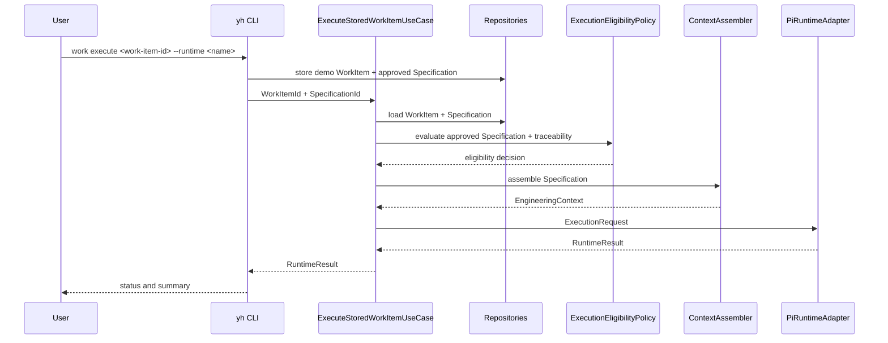

# Execution Flow

## Implemented flow

`ContextAssembler` only projects approved domain Specifications into execution-safe data. `ExecuteStoredWorkItemUseCase` loads the aggregates through repository ports and delegates to `ExecuteWorkItemUseCase`. Neither use case changes WorkItem state after a runtime result; completion remains an explicit engineering decision.

`ExecutionEligibilityPolicy` now makes the approval rule explicit and can additionally require normalized Change provenance when SDD traceability is enabled. An ineligible request stops before the runtime call.

## Current limitation

Repository-backed loading is implemented in Application and verified with an in-memory repository plus `FakeRuntimePort`. The CLI still creates demonstration aggregates and stores them in memory; persistent repositories, user-facing identifiers and contextual requirement selection are not implemented yet. Runtime selection is handled by the composition-level `RuntimeRegistry`.

The Runtime Boundary is also validated directly without repositories through `ExecuteWorkItemUseCase` and `FakeRuntimeAdapter` in `tests/runtime/execute-work-item.test.ts`. The CLI composition root resolves a `RuntimeRegistry` behind the same `RuntimePort`; `fake` is the default and Pi is registered only when explicitly selected, without changing Application.

When a caller supplies neutral Change/task provenance and an `ExecutionTraceRepository`, `ExecuteStoredWorkItemUseCase` records an `ExecutionTrace` after receiving `RuntimeResult`. That record is operational observability, not a Domain relationship, WorkItem transition, approval or evidence decision.

ADR-009 proposes the next post-execution stage: a completed RuntimeResult becomes pending verification, evidence is evaluated against approved Requirements/Scenarios, and only explicit authorization may complete a WorkItem. That stage is not implemented yet.
