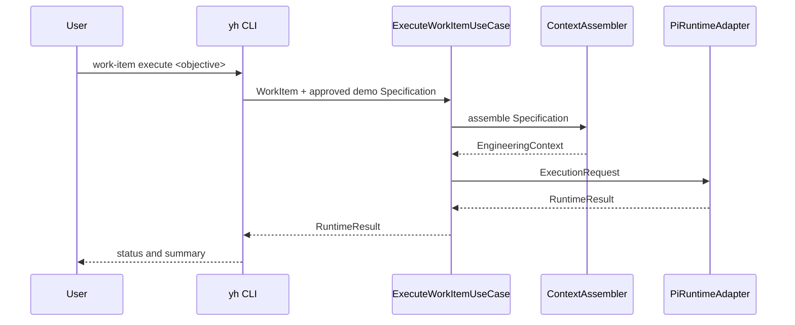

# Execution Flow

## Implemented flow

`ContextAssembler` only projects approved domain Specifications into execution-safe data. `ExecuteWorkItemUseCase` does not change the WorkItem state after a runtime result; completion remains an explicit engineering decision.

## Current limitation

The CLI creates an in-memory demonstration Specification and WorkItem. Repository-backed loading and contextual selection by identifiers are not implemented yet.
