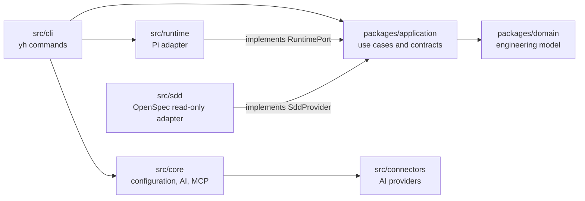

# System Overview

`your-harness` is a CLI-first engineering harness for AI-assisted software work. It separates engineering intent and domain knowledge from the concrete runtime that performs an execution.

## Repository topology

`src/` is the executable harness: CLI composition, provider connectors, MCP skeletons, agents, plugins, skills and workflows. `packages/` is the engineering model: shared primitives, domain aggregates and application use cases.

`src/persistence/local/` provides JSON repositories for YH-owned operational state (`WorkItem` and `ExecutionTrace`) beneath `.your-harness/state/`. It does not mirror provider-owned SDD artifacts.

Application `verification/` provides immutable Evidence and VerificationPlan/Report contracts. Evidence registration references an existing ExecutionTrace; durable evidence/report repositories and verification evaluation remain separate future work.

Each package is an independent composite TypeScript project. The root `tsconfig.json` references Shared, Domain and Application and includes only `src/**`. Cross-project consumers use `@your-harness/domain` and `@your-harness/application`; they do not import package source paths.

## Current vertical slice

The implemented execution path is `WorkItem + approved Specification → ContextAssembler → EngineeringContext → ExecutionRequest → RuntimePort → RuntimeResult`. It is verified independently with a `FakeRuntimePort`; the CLI resolves the selected adapter through `RuntimeRegistry` and uses `fake` by default with demonstration data.

The first SDD integration is independent from this execution path: `OpenSpecSddProvider` reads current specification material and proposed change descriptors through the Application `SddProvider` port. It does not mutate OpenSpec files or pass provider artifacts to the Runtime.

## Source documents

- [ADR-002](../adr/ADR-002.md): Engineering Core and Agent Runtime boundary.
- [ADR-003](../adr/ADR-003.md): Specification model.
- [ADR-004](../adr/ADR-004.md): runtime boundary.
- [ADR-005](../adr/ADR-005.md): Engineering Context.
- [ADR-006](../adr/ADR-006.md): SDD change boundary and provider contract.
- [ADR-007](../adr/ADR-007.md): layered engineering guardrails.
- [ADR-008](../adr/ADR-008.md): user-selectable SDD providers and runtimes.
- [ADR-009](../adr/ADR-009.md): verification, evidence and post-execution interpretation.
