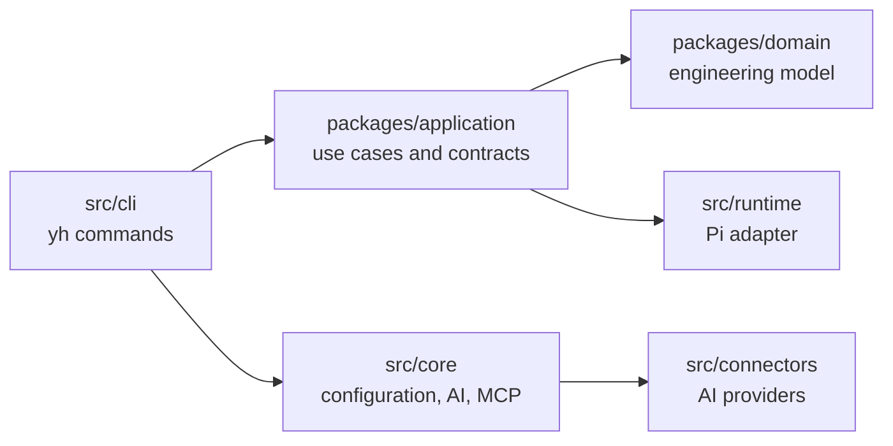

# System Overview

`your-harness` is a CLI-first engineering harness for AI-assisted software work. It separates engineering intent and domain knowledge from the concrete runtime that performs an execution.

## Repository topology

`src/` is the executable harness: CLI composition, provider connectors, MCP skeletons, agents, plugins, skills and workflows. `packages/` is the engineering model: shared primitives, domain aggregates and application use cases.

## Current vertical slice

The implemented execution path is `WorkItem → EngineeringContext → ExecutionRequest → RuntimePort → PiRuntimeAdapter → RuntimeResult`. It is callable through `yh work-item execute` and currently uses an approved demonstration Specification created by the CLI.

## Source documents

- [ADR-002](../adr/ADR-002.md): Engineering Core and Agent Runtime boundary.
- [ADR-003](../adr/ADR-003.md): Specification model.
- [ADR-004](../adr/ADR-004.md): runtime boundary.
- [ADR-005](../adr/ADR-005.md): Engineering Context.
